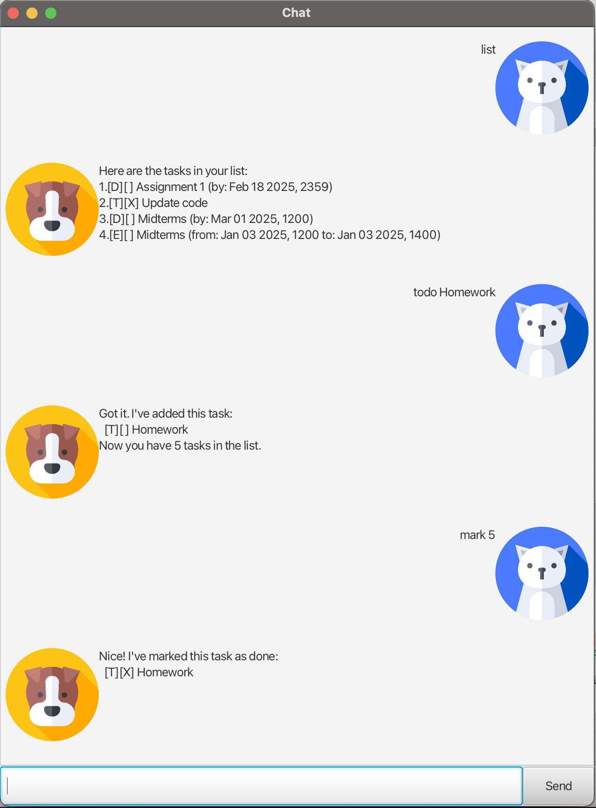
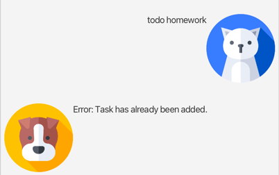

# Chat User Guide

Welcome to Chat Chatbot. 
A simple way to track your tasks that you need to do.
Download and try it out today!

## Adding a todo task: `todo`

Format: `todo TASK_NAME`

Example: 
* `todo Homework`
* `todo House chores`

## Adding a deadline task: `deadline`

Format: `deadline TASK_NAME /by DATE_TIME (dd/MM/yyyy HHmm)`

Examples:
* `deadline Update code /by 21/02/2025 2359`
* `deadline Finish Homework /by 28/02/2025 1200`

## Adding a event task: `event`

Format: `event TASK_NAME /from DATE_TIME  /to DATE_TIME`

Examples:
* `event Midterm /from 24/02/2025 1400 /to 24/02/2025 1600`
* `event School fair /from 20/02/2025 0800 /to 24/02/2025 1800`

## Marking a task: `mark`

Format `mark TASK_ID`

Example:
* `mark 1`

## Unmarking a task: `unmark`

Format `unmark TASK_ID`

Example:
* `unmark 1`

## Delete a task: `delete`

Format `delete TASK_ID`

Example:
* `delete 1`

## Find a task: `find`

Format `find TASK_ID`

Example:
* `find 1`

## Feature: Detect Duplicate

Chat detects duplicates when adding a duplicate task.

Example:

